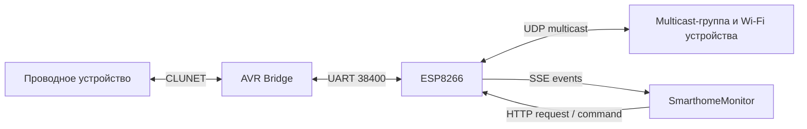

> Исторический аудит состояния до исправлений. Реализованные изменения и результаты проверки от 06.09.2026 описаны в [STABILITY_FIXES.md](STABILITY_FIXES.md). Указанные ниже дефекты и номера строк относятся к исходному снимку.

**Аудит стабильности SmarthomeBridge, AVR Bridge и SmarthomeMonitor**

Дата: 06.09.2026. Пользователь подтвердил прямое подключение Android-приложения к ESP8266; основные симптомы — пропажа событий и зависания.

**Вывод:** в текущих исходниках есть несколько независимых дефектов, которые способны объяснить такие симптомы. Наиболее существенны: прерывание отправки CLUNET следующей командой, переполнение счётчика UART, зависимость локальной обработки от возврата собственного multicast-пакета, несовместимые размеры пакетов и общая задержка SSE из-за медленных клиентов. Конкретную причину прежнего сбоя можно установить только по трассе работающих устройств и версии загруженных прошивок.

Аудит выполнен по текущим рабочим копиям, включая ранее существовавшие незакоммиченные изменения. Производственный код не исправлялся, устройства не опрашивались и не прошивались. Выполнены сборки и изолированные воспроизведения на компьютере.

**Состав системы и зависимости**

| Компонент | Роль и проверенное состояние |
|---|---|
| `smarthome_devices/bridge/src/Bridge` | AVR ATmega8A, проводная CLUNET ↔ UART 38400, собственный журнал очереди на AVR. |
| `smarthome_devices/_lib/clunet` | Общий драйвер шины: прерывания, CRC, арбитраж, отправка, автоматические ответы; `clunet_buffered` — очередь принятых пакетов. Изменения здесь затрагивают другие AVR-устройства. |
| `smarthome_devices/bridge/src/SmarthomeBridge` | ESP8266, UART ↔ multicast `234.5.6.7:12345`, HTTP API, SSE `/events`, веб-журнал и прошивка устройств. Основа Git: `aa02793`; рабочая папка изменена. |
| `Documents/Arduino/libraries/ClunetMulticast` | Отдельный репозиторий, версия библиотеки 1.0.0, HEAD `0ab8755`, два изменённых файла. Здесь находятся также `HexUtils`, `MessageDecoder`, собственный `LinkedList`. Эти изменения не попадут в коммит прошивки автоматически. |
| ESP8266 Arduino Core | Локально установлен и использован 3.1.2. Проверены UART FIFO и контекст Ticker. |
| ESPAsyncUDP / ESPAsyncTCP / ESPAsyncWebServer | Локально 1.1.0 / 2.0.0 / 2.1.2. Проверены приём UDP, multicast join, очереди SSE, отключение HTTP-клиента. |
| ArduinoJson | Локально 7.4.2. В этой версии `DynamicJsonDocument(4196)` не устанавливает верхнюю границу выделяемой памяти. |
| LittleFS / ArduinoOTA / FlashFirmware | Веб-ресурсы, обновления ESP и прошивка AVR; влияют на старт, память и остановку событий. |
| `smarthome_monitor` | Android, HEAD `997284a`; HTTP-команды и SSE напрямую к ESP. OkSse 0.9.0, Jackson 2.8.5, OkHttp используется через зависимости; отдельная версия OkHttp в `app/build.gradle` не закреплена. |
| `smarthome_bridge` | Java-проект, HEAD `0914f5f`. Multicast-коннектор, HTTP-контроллер и старый Supradin-коннектор. В подтверждённой пользователем рабочей схеме не участвует. |

**Как сейчас проходит пакет**

Внутри ESP путь сложнее, чем на схеме. Пакет с UART попадает в `multicastQueue`, отправляется через `send_fake()`, а журнал и обработчик HTTP-ответов видят его через UDP receive callback. Локальная HTTP-команда также сначала уходит в multicast; постановка в `uartQueue` происходит в UDP sniff callback. Прямой локальной доставки для этих двух направлений нет. Поэтому связь «Android ↔ проводное устройство» зависит от возврата multicast, хотя оба нужных обработчика уже находятся на одном ESP.

**Обнаруженные проблемы: сначала исправить пересылку и память**

1. **Приоритет `0` позволяет перезаписывать активную отправку CLUNET. Подтверждено исходниками и воспроизведением.**

   В [Bridge.c](/Users/arthur/Documents/GitHub/smarthome_devices/bridge/src/Bridge/Bridge.c:244) после ожидания вызывается `clunet_send_fake(..., 0, ...)`. Но [clunet_ready_to_send()](/Users/arthur/Documents/GitHub/smarthome_devices/_lib/clunet/clunet.c:316) возвращает `0` и для свободной шины, и для занятого передатчика с приоритетом `0`. Следующий вызов [clunet_send_fake()](/Users/arthur/Documents/GitHub/smarthome_devices/_lib/clunet/clunet.c:140) отключает текущую передачу и переписывает её буфер. Приоритеты драйвера определены как 1–4.

   Исправление: допустимый приоритет и отдельная однозначная проверка состояния TX; новая отправка только после завершения предыдущей. Заменить блокирующее ожидание ограниченной очередью и обработкой из основного цикла. Простая замена `0` на `3` устраняет ложную готовность, но оставляет переполнение UART во время ожидания занятой шины. При зависшей шине ожидание также мешает обслуживать watchdog.

2. **Счётчик приёма UART на ESP не способен представить размер своего буфера. Подтверждено тестом и компилятором.**

   [SmarthomeBridge.ino](/Users/arthur/Documents/GitHub/smarthome_devices/bridge/src/SmarthomeBridge/SmarthomeBridge.ino:658): буфер 256 байт, длина — `unsigned char`. В [цикле чтения](/Users/arthur/Documents/GitHub/smarthome_devices/bridge/src/SmarthomeBridge/SmarthomeBridge.ino:823) условие `< 256` всегда истинно. При достижении 256 длина становится нулём, флаг overflow не выставляется. Данные теряются без отражения в диагностике.

   Исправление: тип, вмещающий полный размер, и согласованное изменение объявлений в `FlashFirmware.cpp`; предпочтительно кольцевой приёмник с последовательным разбором. Не читать весь накопившийся поток до первого разбора. Считать переполнения и отброшенные байты, а не хранить кратковременный boolean.

3. **Зависимость от multicast loopback. Дефект архитектуры подтверждён; фактическую доставку loopback нужно измерить на устройстве.**

   Постановка в UART находится в [UDP sniff callback](/Users/arthur/Documents/GitHub/smarthome_devices/bridge/src/SmarthomeBridge/SmarthomeBridge.ino:415); UART-вход только копирует пакет в [multicastQueue](/Users/arthur/Documents/GitHub/smarthome_devices/bridge/src/SmarthomeBridge/SmarthomeBridge.ino:630). Библиотека обрабатывает ответы и события только в [UDP receive](/Users/arthur/Documents/Arduino/libraries/ClunetMulticast/src/ClunetMulticast.cpp:73). `_send()` сам этот путь не вызывает. Наличие loopback нельзя вывести из успешного `_udp.send()`.

   Исправление: единый локальный обработчик принятого пакета с явным происхождением `UART`, `UDP`, `HTTP`. UART-пакет сразу передавать подписчикам/ожидающему запросу, а публикацию в multicast выполнять отдельным действием. HTTP-команду маршрутизировать в UART непосредственно. Собственные отражённые UDP-пакеты должны распознаваться и не вызывать вторую обработку. Нельзя просто добавить прямую доставку и оставить старый sniff без защиты от дублей.

   Сейчас отбор multicast → UART проверяет только источник. Пакеты Wi-Fi → Wi-Fi тоже нагружают проводную шину. Добавить проверку назначения: проводной адрес или broadcast. Существующее разделение источников старшим битом предотвращает простое эхо через один мост, но не заменяет определение происхождения и защиту от повторов.

4. **Несовместимые пределы длины; один пакет может остановить очередь целиком. Подтверждено.**

   | Участок | Фактическое ограничение |
   |---|---|
   | Приём multicast | До 128 байт данных + заголовок 4 байта. |
   | ESP UART TX | `availableForWrite()` не превышает 128 байт; код требует разместить весь кадр, то есть данные + 9 байт. Пакеты с данными 120–128 байт не проходят никогда. |
   | AVR UART RX | Буфер 96 байт; полный кадр с обычным пакетом вмещает не более 87 байт данных. |
   | AVR UART TX | Буфер 96 байт; строгие проверки `<` дополнительно уменьшают доступную длину при сборке кадра. |
   | CLUNET → UART очередь AVR | Только 64 байта данных, 4 сообщения. Более длинные пакеты отвергаются. |
   | Загрузчик | Встречаются полезные данные 68 байт: 64 байта прошивки + 4 байта служебных полей; полный UART-кадр 77 байт. |

   [uart_can_send()](/Users/arthur/Documents/GitHub/smarthome_devices/bridge/src/SmarthomeBridge/SmarthomeBridge.ino:83) и [цикл очереди](/Users/arthur/Documents/GitHub/smarthome_devices/bridge/src/SmarthomeBridge/SmarthomeBridge.ino:840) оставляют неподходящий пакет в начале очереди и прекращают обработку. Все следующие команды задерживаются, очередь продолжает расти.

   Исправление: документировать пределы для каждого транспорта и типа сообщения, проверять их до постановки в очередь; неподдерживаемый размер возвращать как явную ошибку. Передачу UART делать по частям без требования вместить весь кадр в аппаратный FIFO, если необходимы длинные кадры. Начальный совместимый вариант — ограничить обычный мост проверенным размером 64 байта, сохранив отдельный допустимый формат загрузчика. Поддержка 128 байт потребует согласованной переработки AVR, а не только константы на ESP.

5. **Кольцевая очередь AVR неправильно определяет заполнение после оборота счётчиков. Подтверждено тестом.**

   [clunet_buffered.h](/Users/arthur/Documents/GitHub/smarthome_devices/_lib/clunet/clunet_buffered.h:34) вычисляет `head-tail` после целочисленного продвижения. Для заполненной очереди при `head=0`, `tail=252` получается `-252`, а не `4`. Проверка заполнения не срабатывает; новые данные могут перезаписывать непрочитанные.

   Исправление: корректная модульная арифметика или отдельный счётчик; проверить все переходы через 255. Явно определить обмен между ISR и основным циклом: видимость индексов и порядок публикации полностью записанного элемента. Ошибку `clunet_buffered_push()` сейчас [игнорируют](/Users/arthur/Documents/GitHub/smarthome_devices/bridge/src/Bridge/Bridge.c:155); добавить причины отказа и счётчики.

6. **Проверки CRC недостаточно: внутренние длины и декодеры могут выйти за буфер. Подтверждено четырьмя ASan-воспроизведениями.**

   - Оба обработчика UART проверяют только `length >= 4`, но не `length == 4 + packet.size`. [packet.copy()](/Users/arthur/Documents/Arduino/libraries/ClunetMulticast/src/ClunetMulticast.h:30) доверяет внутреннему полю размера. Возможны чтение за границей принятого сообщения и пересылка мусора даже при корректной CRC внешнего кадра.
   - В [HexUtils.cpp](/Users/arthur/Documents/Arduino/libraries/ClunetMulticast/src/HexUtils.cpp:31) индекс декодирования имеет тип `char`. На проверенном ESP toolchain `char` беззнаковый: для HEX-строки длиной 256 индекс оборачивается в ноль, цикл продолжает писать за выходной буфер. Это ровно 128 байт данных, разрешённых multicast-протоколом. Нет проверки нечётной длины, допустимых символов или размера назначения; lowercase превращается в неверные значения.
   - В [fillMessageData()](/Users/arthur/Documents/GitHub/smarthome_devices/bridge/src/SmarthomeBridge/SmarthomeBridge.ino:720) `hex[256]` недостаточен для 128 байт: необходим ещё завершающий ноль.
   - [MessageDecoder.h](/Users/arthur/Documents/Arduino/libraries/ClunetMulticast/src/MessageDecoder.h:43) не получает длину входа и размер выхода. Корректный по внешнему формату пакет с 22 короткими температурными записями переполняет временный буфер 512 байт. Укороченные sensor/fan/switch payload также не проверяются перед чтением. HTTP `id` копируется через `strcpy()` в 64 байта без ограничения.

   Исправление: одна проверка конверта на каждом входе, отдельные проверки форматов команд, функции преобразования с длиной и ёмкостью, `size_t` для индексов. Ошибка декодирования не должна мешать пересылке валидного сырого пакета и доставке других событий. Для некорректного содержимого журнал должен показывать raw payload и причину ошибки.

7. **Незавершённый UART-кадр не имеет таймаута восстановления. Подтверждено тестом.**

   В [парсере ESP](/Users/arthur/Documents/GitHub/smarthome_devices/bridge/src/SmarthomeBridge/SmarthomeBridge.ino:686) правдоподобная, но ложная длина заставляет ждать продолжение; валидный кадр за ней остаётся неразобранным. На AVR аналогичный алгоритм. Если поток замолчал, ожидание сохраняется; при следующем трафике восстановление зависит от накопившихся байтов и CRC.

   Исправление: конечный автомат, ограничение длины, таймаут незавершённого кадра с учётом 38400 бод и максимального кадра, восстановление после мусора/неполной преамбулы. Счётчики CRC, timeout, resync, UART hardware overrun и framing error. На AVR читать соответствующие флаги UART вместе с байтом.

**Причины потери событий и зависаний на ESP → Android**

8. **Очереди пересылки, HTTP и ответов не имеют достаточных ограничений. Высокий риск под нагрузкой.**

   [uartQueue, multicastQueue, apiRequestsQueue](/Users/arthur/Documents/GitHub/smarthome_devices/bridge/src/SmarthomeBridge/SmarthomeBridge.ino:65) растут без верхней границы и срока жизни. При недоступной сети, заблокированном начале UART-очереди или медленном обслуживании HTTP память расходуется дальше. [LinkedList.add()](/Users/arthur/Documents/Arduino/libraries/ClunetMulticast/src/StringArray.h:66) проходит всю очередь; рост очереди увеличивает и расход CPU. `packet.copy()` и выделение узла не имеют безопасной обработки отказа.

   История [ClunetMulticast](/Users/arthur/Documents/Arduino/libraries/ClunetMulticast/src/ClunetMulticast.cpp:164) хранит ответы нескольких запросов, но не ограничивает число ответов в каждом. Исправление: очереди с лимитами по байтам/пакетам и времени, O(1) добавление/извлечение, политика отказа, максимальный возраст команды, освобождение результатов после использования. Команда, уже принятая в очередь, не должна молча исчезать.

9. **Медленный SSE-клиент задерживает выдачу событий остальным. Подтверждено логикой кода.**

   [SmarthomeBridge.ino](/Users/arthur/Documents/GitHub/smarthome_devices/bridge/src/SmarthomeBridge/SmarthomeBridge.ino:870) отправляет следующую пачку только при `events.avgPacketsWaiting()==0`. Это общий показатель всех клиентов, округляемый библиотекой. При накоплении у медленного клиента обработка общей очереди останавливается; [при достижении 128 событий](/Users/arthur/Documents/GitHub/smarthome_devices/bridge/src/SmarthomeBridge/SmarthomeBridge.ino:427) старые молча удаляются. Библиотека имеет дополнительную очередь на каждого клиента и также может отбрасывать сообщения.

   Исправление: собственный прогресс каждого клиента, ограниченный backlog, отключение сильно отставших с понятной причиной; быстрый клиент получает события независимо от медленного. Не использовать среднее как общее разрешение отправки. Ограничивать объём JSON по байтам и времени работы цикла.

10. **Переподключение SSE не восстанавливает пропущенные события и может доставить устаревшие действия. Подтверждено кодом.**

    Сервер отправляет `SERVICE` только при подключении, регулярного heartbeat нет. `Last-Event-ID` доступен в библиотеке, но приложение сервера его не использует. Счётчик `event_id` относится к пачке, а не к отдельному исходному событию. Очередь не является историей на клиента. Веб-журнал принудительно переподключается после 45 секунд без DATA; Android настраивает SSE timeout 30 секунд.

    Даже когда подписчиков нет, общая очередь сохраняет последние 128 сообщений. После нового подключения старые пакеты могут прийти в [MainService](/Users/arthur/Documents/GitHub/smarthome_monitor/app/src/main/java/com/gargon/smarthome/MainService.java:143), который выполняет переключение блокировки/медиа без проверки возраста или уникальности события.

    Исправление: heartbeat, `bootId + sequence`, обнаружение разрывов и согласованное поведение после reconnect. Для состояния — актуальный snapshot и повторная синхронизация; для одноразовых действий — уникальность и срок актуальности. Не воспроизводить старые нажатия как новые. Окно replay ограничить памятью; более старый разрыв явно сообщать клиенту.

11. **Wi-Fi/multicast не имеют полноценного восстановления. Подтверждено отсутствием соответствующего пути.**

    [clunet.connect()](/Users/arthur/Documents/GitHub/smarthome_devices/bridge/src/SmarthomeBridge/SmarthomeBridge.ino:402) вызывается один раз. После потери/возврата Wi-Fi нет явного закрытия UDP, повторного join multicast-группы и регистрации исправного состояния. `clunetReady` сохраняет результат первого подключения, а `_udp.connected()` обозначает состояние объекта сокета, не доставку пакетов.

    При ошибке LittleFS `setup()` заканчивается до настройки сети и перестановки UART; транспорт тоже не запускается нормально. При недоступном Wi-Fi во время старта предусмотрен reboot, а не управляемый режим восстановления.

    Исправление: автомат состояний Wi-Fi/UDP с повторами и задержками; callbacks зарегистрировать независимо от успеха первой попытки. На disconnect сбрасывать фактическую готовность, завершать/отменять запросы, ограничивать очередь. После IP-up заново привязывать UDP и входить в группу. Отделить запуск транспорта от доступности веб-файлов.

12. **Ожидание HTTP-ответов содержит ошибки сопоставления и создаёт искусственные задержки. Подтверждено.**

    - В [api_request/api_response](/Users/arthur/Documents/GitHub/smarthome_devices/bridge/src/SmarthomeBridge/SmarthomeBridge.h:28) фильтр хранится как `uint8_t`, хотя `-1` означает «без фильтра». Условие `< 0` никогда не выполняется; фактически выбирается команда 255.
    - Ответ проверяется по команде и назначению ESP, но не по адресу ожидаемого устройства и разновидности payload. Поздний ответ предыдущего запроса или другой датчик может быть принят как текущий.
    - HTTP-таймаут в [ClunetMulticast.request()](/Users/arthur/Documents/Arduino/libraries/ClunetMulticast/src/ClunetMulticast.cpp:177) начинается после отправки UDP, а пакет на проводную шину может ещё стоять в очереди.
    - Ответ возвращается по истечении всего timeout, даже если единственный нужный ответ уже пришёл. Одновременно активен один запрос.
    - `/command` и специализированные `/api/*` возвращают успех без проверки доставки устройству; `/command` игнорирует даже ошибку `clunet.send()`.

    Исправление: отдельный признак наличия фильтра, адрес/команда/подтип/временное окно ответа, deadlines очереди и ожидания отдельно. Для unicast завершать запрос при подходящем ответе; discovery собирать в течение окна. Возвращать состояния «принято», «подтверждено», «истёк срок», «перегрузка». Сохранить внесённую ранее защиту HTTP-request при disconnect и проверку requestId; проверить её отменой запросов под нагрузкой.

    Текущий wire-протокол не содержит transaction ID: полностью различить два одинаковых поздних ответа только локальным `requestId` невозможно. Для совместимого этапа сериализовать конфликтующие запросы и проверять содержимое; для полной корреляции потребуется согласованное расширение протокола. Повторы применять только к операциям, которые можно безопасно выполнить повторно, либо с дедупликацией на принимающей стороне.

13. **Тяжёлая обработка HTTP-ответа выполняется из Ticker SYS callback. Риск задержек/повторного входа; не доказанный аппаратный crash.**

    [Ticker.once_ms()](/Users/arthur/Documents/Arduino/libraries/ClunetMulticast/src/ClunetMulticast.cpp:194) вызывает создание JSON, декодирование всей истории и `webRequest->send()`. В установленном Core callback исполняется в SYS-контексте. Перенести окончание запроса и работу с памятью/HTTP в `loop()`, оставив таймеру флаг или проверяя deadline прямо в цикле. Это соответствует рекомендации [ESP8266 Core 3.1.2](https://arduino-esp8266.readthedocs.io/en/3.1.2/libraries.html#ticker) выносить IO из callback таймера; сам по себе вызов async send не доказывает блокировку.

14. **SmarthomeMonitor создаёт лишние соединения и долго блокирует действия полным опросом. Подтверждено.**

    [HeatfloorBridgeClient.loadSnapshot()](/Users/arthur/Documents/GitHub/smarthome_monitor/app/src/main/java/com/gargon/smarthome/heatfloor/HeatfloorBridgeClient.java:53) выполняет 12 последовательных запросов: состояние, режимы и 10 программ. Каждый удерживается мостом 1200 мс: номинально около 14,4 секунды плюс сеть и очередь. Это выполняется при открытии, после действия и через 30 секунд после окончания предыдущего обновления. Экран блокирует управление на время такого обновления.

    MainService и видимая Activity создают собственные SSE-клиенты. После переходов между Activity уже начатый HTTP-опрос может ещё выполняться. `parseRequiredPayload()` принимает первый payload, не сверяя source/command/ожидаемый тип программы. Ошибка одного listener в SSE-клиенте прерывает обработку остальной текущей пачки. `onClosed()` пуст; при существующем объекте с тем же URL MainService не проверяет здоровье подключения. Сервис возвращает `START_NOT_STICKY`.

    Исправление: один сетевой владелец/репозиторий данных и один SSE на приложение, общий snapshot, отдельные небольшие обновления изменившегося состояния. Программы кэшировать и читать по необходимости. После записи проверять конкретное изменённое значение. Добавить отмену HTTP-вызовов по lifecycle, проверку типа ответа, состояние связи/свежести, изоляцию ошибок отдельных событий и listener. Поведение сервиса после уничтожения системой проверить отдельно на целевом Android.

**Дополнительные замечания**

- [FlashFirmware](/Users/arthur/Documents/GitHub/smarthome_devices/bridge/src/SmarthomeBridge/FlashFirmware.cpp:595) глобально заглушает SSE и обычные запросы на 10 секунд после bootloader activity. Это может выглядеть как зависание; активный режим прошивки должен иметь отдельное явное состояние и общий deadline. При начале сессии очереди очищаются без уведомления клиентов. HTTP-команды могут получить `OK`, хотя из-за изоляции не уйдут в UART. При больших пользовательских timeout изоляция может истечь раньше активной сессии. Предусмотреть статус maintenance, отказ новым обычным командам и восстановление подписчиков/snapshot при выходе.
- `flashFirmware[8192]` постоянно занимает RAM ESP даже вне обновления; включить его в бюджет памяти. Перенос образа в файл рассматривать отдельно от срочных транспортных исправлений.
- [Веб-журнал](/Users/arthur/Documents/GitHub/smarthome_devices/bridge/src/SmarthomeBridge/data/www/log.html:597) скрывает одинаковые пакеты в течение 1200 мс. Это маскирует реальные повторные события и мешает расследованию. Добавить raw-режим без подавления; идентифицировать транспортный дубль по происхождению/sequence, а не только содержимому.
- [ClunetMulticast::_send()](/Users/arthur/Documents/Arduino/libraries/ClunetMulticast/src/ClunetMulticast.cpp:145) передаёт в `onPacketSent` адрес объекта `AsyncUDPMessage`, приведённый к `clunet_packet*`, вместо его буфера `data()`. Сейчас callback здесь не зарегистрирован; перед использованием для прямой доставки это обязательно исправить.
- [ESPAsyncUDP::_recv()](/Users/arthur/Documents/Arduino/libraries/ESPAsyncUDP/src/AsyncUDP.cpp:177) трактует каждый сегмент pbuf-цепочки как отдельную датаграмму и вычисляет заголовки отрицательными смещениями от payload. Риск для составных буферов/фрагментации; воспроизведение на целевом lwIP ещё нужно. Проверить сохранение границ одной датаграммы до решения об обновлении/замене библиотеки.
- `discovery_observe_time` на AVR уменьшается без насыщения на нуле, а число ответов не дедуплицируется. При отрицательном остатке подсчёт продолжается; при счётчике выше 99 индекс десятков выходит за таблицу цифр. Исправить насыщение таймеров, диапазон индикации и считать уникальные устройства.
- В `fillValueData()` температурный датчик выбирается при `strcmp(...) != 0`, то есть при несовпадении ID; в декодере сравнение signed short с `0xFFFF` не работает на ESP. Это ошибки данных, вторичные к стабильности транспорта.
- IP по умолчанию Android и статический IP текущего ESP различаются; сохранённая настройка может это компенсировать. Зафиксировать фактическую конфигурацию стенда и способ назначения адреса.
- В неиспользуемом сейчас Java-коннекторе [MulticastSocket.java](/Users/arthur/Documents/GitHub/smarthome_bridge/multicast-connector/src/main/java/com/gargon/smarthome/multicast/socket/MulticastSocket.java:51) Enumeration сетевых интерфейсов расходуется при первых пакетах и затем становится пустой; собственные пакеты распознаются непоследовательно. Нет выбора интерфейса/rejoin после сетевых изменений, исключения скрыты, listener исполняется в потоке приёма. Исправлять перед возвращением этого сервера в эксплуатацию.

**Что уже проверено экспериментально**

| Проверка | Результат |
|---|---|
| Сборка ESP8266 | Успешна: Core 3.1.2, generic, 80 MHz, 4M/1M FS, lwIP v2 Higher Bandwidth, текущие локальные библиотеки. Компилятор подтвердил всегда истинное сравнение UART и всегда ложный тест `<0` фильтра. |
| Память ESP при линковке | 42 532 / 80 192 байт статической RAM; код IRAM 29 627 байт при 32 768 байтах cache, суммарно 62 395 / 65 536. Это не измерение свободной heap после подключения Wi-Fi. |
| Сборка AVR | Успешна установленным AVR GCC 7.3, `-mmcu=atmega8`, 16 MHz, флаги типов/оптимизации по Debug-проекту. Flash 3802 байта; static RAM 788 / 1024 байта. Это проверка совместимым MCU target, а не побайтовое воспроизведение Atmel Studio/DFP сборки. |
| UART ESP, 256 принятых байт | Счётчик становится 0, overflow остаётся false. |
| FIFO AVR, оборот индексов | Для четырёх непрочитанных записей `count=-252`, очередь ошибочно считается незаполненной. |
| Занятый CLUNET TX с priority=0 | Функция возвращает 0 — ложная готовность. |
| Фильтр HTTP `-1` | Сохраняется как 255, ответ с командой 0x61 отвергается. |
| UART TX при пустом FIFO | Payload 119 байт проходит; 120 и 128 байт не проходят даже в пустой FIFO. |
| Неполный UART-кадр перед валидным | Повторный разбор не доставляет валидный кадр без новых байтов/сброса. |
| HEX decode, 256 символов | AddressSanitizer обнаружил запись за буфером после оборота индекса. |
| HEX encode, 128 байт в `hex[256]` | AddressSanitizer обнаружил запись завершающего нуля за буфером. |
| Температурный payload 22 коротких датчика | AddressSanitizer обнаружил выход за временный буфер 512 байт. |
| Внутренний packet.size больше UART payload | AddressSanitizer обнаружил чтение за входным буфером при `packet.copy()`. |

Всего 10 изолированных воспроизведений. Они используют текущие функции/структуры/макросы либо их минимальные выражения и `-funsigned-char`, совпадающий с проверенным ESP toolchain. Аппаратные тайминги ISR, lwIP, радиоканал и реальный heap ими не проверяются. Во время сборки Arduino CLI сообщил о недоступности сети для скачивания discovery-инструментов; это не помешало завершению компиляции и линковки. Никакая загрузка прошивок не выполнялась.

**План исправлений и критерии готовности**

| Порядок | Работа | Критерий завершения |
|---|---|---|
| 0 | Зафиксировать исходную точку: коммиты и локальные diff трёх рабочих компонентов, версии библиотек, параметры сборки, контрольные суммы образов, реальные версии на устройствах. Добавить наблюдаемость. | На каждом перезапуске видны bootId, версия и reset reason; по каждому переходу доступны RX/TX/drop/error/queue counters. |
| 1 | Исправить счётчик UART ESP, кольцевую очередь AVR, priority=0, границы кадров, HEX и декодеры. Сохранить совместимость загрузчика. | Все воспроизведения преобразованы в регрессионные проверки ожидаемого исправленного поведения; ASan/UBSan чисты, предупреждения о диапазонах устранены. |
| 2 | Сделать прямую локальную маршрутизацию с явным источником пакета, отбором destination и защитой от собственного multicast-эха. | HTTP → проводное устройство и UART → HTTP/SSE работают при отсутствии возврата собственного UDP; каждый физический пакет даёт ровно одно локальное событие. |
| 3 | Неблокирующий TX на AVR, UART parser state machine, bounded queues/TTL на ESP. Ввести явные причины отказа. | Один неподходящий/повреждённый кадр не блокирует следующие; при перегрузке память ограничена, отказ виден клиенту и в счётчиках. |
| 4 | Согласовать пропускную способность ESP ↔ AVR. Для гарантии приёма добавить версионированные UART credits/ACK с negotiated capability и совместимостью bootloader. | После «принято AVR» пакет не перезаписывается следующей отправкой. ACK приёма отличим от завершения передачи CLUNET и ответа конечного устройства. |
| 5 | Перенести обработку запросов в loop, исправить фильтры/сопоставление, раннее завершение unicast, deadlines и отмену. | Ответ чужого устройства не засчитывается; отключившийся HTTP-клиент не вызывает crash/leak; перегрузка и timeout имеют явный результат. |
| 6 | Исправить SSE: независимость клиентов, heartbeat, sequence/bootId, обнаружение разрыва, ограниченный replay и snapshot, отсутствие повторного выполнения старых действий. | Медленный клиент не задерживает быстрый; reconnect восстанавливает состояние либо сообщает о разрыве; повтор события не переключает действие второй раз. |
| 7 | Автомат восстановления Wi-Fi/multicast и режима прошивки; отделить транспорт от веб-FS. | После выключения/возврата AP, IP-change и временной ошибки join работа восстанавливается без ручного reboot; maintenance имеет понятный статус и завершение. |
| 8 | Общий сетевой клиент SmarthomeMonitor, кэш программ, частичные опросы, проверки ответа, отмена и индикатор свежести. | На приложение одно SSE; открытие страницы и запись настройки не ждут обязательного чтения 10 программ; фоновые действия не обновляют закрытый экран. |
| 9 | Длительный стендовый прогон с инъекцией ошибок и нагрузкой. | Выполнена матрица ниже, сохранены логи и измеренный предел устойчивой нагрузки. |

Этапы 1–3 — первый обязательный набор для стабилизации. Этап 4 меняет транспортный контракт и должен поставляться согласованно для ESP/AVR; временная фиксированная задержка между пакетами не заменяет flow control. Обновлять весь стек библиотек одновременно с исправлением логики не следует: сначала воспроизводимая базовая сборка, затем отдельная проверяемая миграция. Особенно важно учитывать [изменение модели памяти ArduinoJson 7](https://arduinojson.org/v7/how-to/upgrade-from-v6/): число в старом конструкторе больше не задаёт лимит.

Не увеличивать буферы AVR без пересчёта SRAM и измерения запаса стека: в пробной сборке остаётся только 236 байт сверх статических данных. Не объявлять успешный UDP send подтверждением получения команд. Не скрывать реальные повторные нажатия сравнением одинаковых payload. Переход на ESP32/Ethernet/MQTT можно рассмотреть после измерений, но перечисленные ошибки очередей и маршрутизации сначала нужно устранить в любом варианте.

**Диагностика для поиска именно прежнего зависания**

Добавить: `uptime`, `bootId`, reset reason, max loop duration, текущую/min heap, max free block, очередь и максимальную очередь в байтах/пакетах; UART bytes/frames/CRC/framing/overrun/resync/timeout; CLUNET receive/CRC/TX-start/TX-complete/busy-timeout/FIFO-drop; multicast RX-valid/invalid/TX-ok/error/own-echo/rejoin; event accepted/sent/dropped и прогресс каждого клиента; HTTP queue-wait/roundtrip/timeout/cancel; maintenance reason/deadline.

Уточнить смысл имеющихся discovery-счётчиков: сейчас «returnedToHttp» растёт при сборке JSON, до подтверждения получения клиентом; `uartRxOverflow` сбрасывается в цикле и не показывает историю. Счётчики должны отражать конкретный переход, а наблюдение при отсутствии потока — опираться на heartbeat, не на предположение, что событие обязано было появиться.

При сбое сопоставить последовательности на четырёх границах: CLUNET → AVR, AVR → ESP UART, ESP accepted event, Android received/applied. Снимать UART логическим анализатором, multicast — packet capture на участвующем хосте. Отсутствие multicast в захвате постороннего Wi-Fi-клиента само по себе не доказывает отсутствие передачи. Если ESP отвечает HTTP, но event sequence не растёт, это другой класс сбоя, чем потеря питания или reset.

**Матрица стендовых проверок**

| Сценарий | Что измерить/проверить |
|---|---|
| Одиночные помеченные ping/ответы в обоих направлениях | Сопоставить UART/UDP/SSE и endpoint; не использовать управляющие устройствами команды как нагрузочный генератор. |
| Серии 1/5/10/20/50/100 пакетов в секунду с разными длинами | Найти устойчивый предел; учитывать физическую длительность CLUNET и загрузку шины другими устройствами. Нагрузки выше предела — проверка корректного отказа, а не требование доставить невозможный объём. |
| Длины payload 0/1/63/64/65/68/86/87/88/119/120/128 и недопустимые | Каждый формат либо целиком проходит допустимый путь, либо отклоняется с причиной; никакого зависшего начала очереди. |
| CRC-ошибка, оборванная/ложная преамбула, потеря байта, несовпадение size | Парсер восстанавливается за ограниченное время; следующий корректный кадр доставляется. |
| Обороты FIFO и таймеров | Более 256 сообщений; все head/tail boundary cases; искусственный переход `millis()` через wrap. |
| Нет возврата собственного multicast; затем echo/дубли | Прямой путь HTTP ↔ UART/SSE продолжает работать; дубль не выполняет команду второй раз. |
| Один быстрый SSE и один медленный/зависший, Android + браузер | Задержка быстрого не определяется медленным; отставание ограничено, drops имеют sequence и причину. |
| 5–10 минут без событий, затем новое событие | Heartbeat сохраняет живое соединение; отсутствие DATA не считается сбоем само по себе. |
| Разрыв Wi-Fi, reboot AP, IP-change, ошибка multicast join | Автоматическое восстановление, ограниченная очередь, отсутствие повторного выполнения устаревших команд. |
| HTTP timeout/disconnect, два клиента, чужой/поздний ответ | Нет use-after-free/утечки; правильное сопоставление; deadline включает ожидание в очереди. |
| Открытие/закрытие экранов, Android background/kill/restart | Нет лишних SSE и продолжающегося бесконтрольного опроса; свежесть состояния видна. |
| Прошивка AVR: успех/ошибка/отмена/timeout | Чёткий maintenance, восстановление обычного трафика и подписок; bootloader-кадр 77 байт поддерживается. |
| 24–72 часа с обычной нагрузкой и периодическими сбоями | Нет необъяснимых потерь, watchdog reset и нисходящего тренда heap; хвосты задержки и причины drop записаны. |

Численные цели задержки задать после базового замера. Для первого стенда разумно проверять нормальную нагрузку с запасом относительно найденного предела и требовать ноль **необъяснимых** потерь между принятыми системой пакетами и их учтённым исходом. Потери UDP/радиоканала отделять от программных потерь по границам; доставку конечному устройству подтверждать его ответом.

Остаётся проверить на железе: версия реально загруженных образов, поведение multicast на точке доступа, уровень/качество UART и CLUNET, питание ESP, реальная глубина стека AVR, события reset и длительность прерываний. Эти факторы пока не объявляются причиной сбоя.

**Материалы воспроизведения**

[Результаты и SHA-256 исходников](/Users/arthur/Documents/GitHub/smarthome_devices/bridge/src/SmarthomeBridge/docs/stability-audit/evidence.json). [Изолированный проверочный скрипт](/Users/arthur/Documents/GitHub/smarthome_devices/bridge/src/SmarthomeBridge/docs/stability-audit/reproduce.py) компилирует фрагменты текущего кода через clang++ с AddressSanitizer/UndefinedBehaviorSanitizer, не подключаясь к устройствам. Запуск: `python3 docs/stability-audit/reproduce.py`; аргументы `--root`, `--library`, `--output` переопределяют пути. Ожидаемый результат для исследованной версии — подтверждение 10 дефектных сценариев; после исправлений этот исторический скрипт нужно адаптировать в регрессионные тесты правильного поведения.
